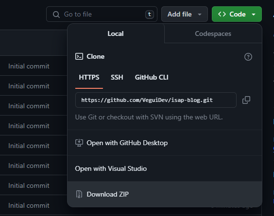
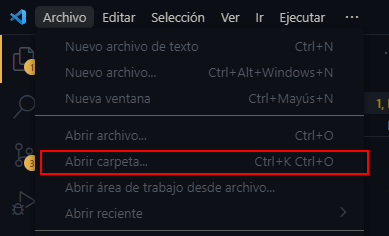
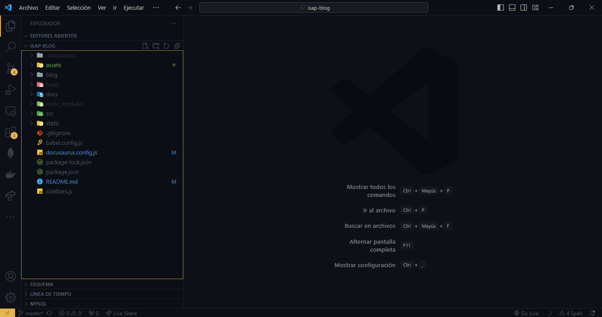
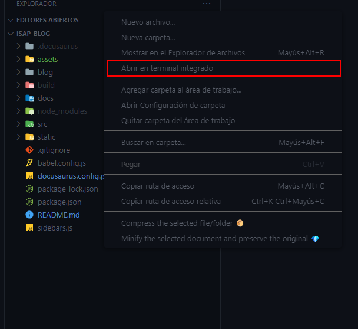
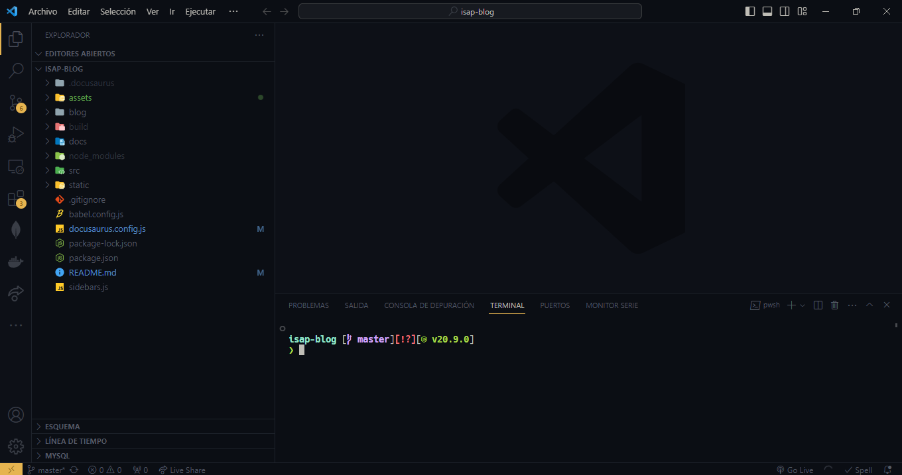

# Código de la página de blogs del Padua

Antes de crear un blog es importante que conozcas que se está usando aca y como poner todo a funcionar a nivel local.

## Iniciar entorno de desarrollo

### Requisitos

Debes instalar los siguientes programas en tu computadora.

- [Node.js](https://nodejs.org/en) Descarga la versión LTS.
- [Visual Studio Code](https://code.visualstudio.com/).

### Iniciar el proyecto

Lo primero que tenes que hacer es clonar este repositorio o usar el código proporcionado por el colegio. Para clonar este podes usar git, pero si no sabes como hacerlo descargalo apretando desde acá.



Una vez en la carpeta con los archivos la debes abrir en **Visual Studio Code**, haciendo click acá.



Una vez hagas eso, tendrás el proyecto abierto en el editor de código, las partes más importantes son:

### Panel de archivos



En esta parte están todos los archivos del proyecto, antes de empezar a editar. Te voy a enseñar a poner a funcionar el entorno de desarrollo.

Para eso, primero vamos a abrir un terminal en la carpeta del proyecto. Para esto hace click derecho en una parte vacía del panel de archivos y en el menu contextual presiona _"Abrir terminal integrado"._



Y aparecerá un nuevo panel.



Mi terminal es diferente al que te va a aparecer a vos, pero funciona igual.

## Primera vez

La primera vez que haces esto en tu computadora debes preparar el entorno instalando las dependencias, para eso en el terminal que abrimos antes ejecuta este comando.

```bash

npm install

```

_Para hacer esto escribí esa linea y presiona enter._

### Ejecutar el entorno de desarrollo

Ahora todo está listo, solo debes ejecutar este comando y cuando termine de compilarse el Cliente se abrirá el navegador.

```bash
npm start
```

Puede que tarde un poco en verse algo en el navegador, se paciente tarda un poco.

Cuando termines la sesión de edición presiona `ctrl+C` para detener el servidor de desarrollo.

## Crear/Editar posts

Los blogs los podes encontrar en la carpeta `/blog`, cada archivo _.md_ es un post, los nombres no son aleatorios tienen un formato.

```js
[ano - mes - dia] - nombre - del - post.md;
```

Para nombrar a los archivos no uses espacios pone `-` y todo en minúsculas.

Los artículos están escritos en Markdown un lenguaje de marcado como HTML pero más simple.

### Recursos

Te voy a dar unos recursos para que puedas consultar como editar estos archivos.

- [Documentación de Markdown](https://www.markdownguide.org/cheat-sheet/)

- [Documentación de los blogs de Docusaurus](https://docusaurus.io/docs/blog)

## Partes de los artículos

Voy a explicarte las partes que tienen las publicaciones para que tengas una idea de como editarlos y crearlos. Si queres más información podes encontrarla en los [recursos](#recursos) o buscar por internet más documentación ya que son tecnologías muy conocidas y usadas ampliamente, que no son difíciles de usar.

### Cabeza del articulo

La cabeza del articulo se define con unos separadores y aquí podes configurar información del post como el slug, titulo, autores y tags.

```yaml
---
slug: post-de-ejemplo # Esto se ve en la url, ej: https://ipadua.edu.ar/blog/post-de-ejemplo
title: Post de ejemplo # Este es el titulo que se ve en la página.
authors: [veguidev] # Los autores para poner varios [veguidev, felipe]
tags: [facebook, docusaurus, nuevo, 2023] # Las etiquetas
---
```

Y después de eso el contenido.

```markdown
Este es el post que cree en el `README.md` para mostrar como hacerlo, deberías borrarme :).
```

Una vez creado el archivo y escrita esta información usa `ctrl+s` para guardar e inmediatamente podrás ver los cambios que hagas 🌟.

## Autores

Por ultimo los autores de los artículos deben estar en el archivo `authors.yml`. Te explico la sintaxis del archivo.

```yml
veguidev: # Identificador del autor (debe ser único y no uses ni espacios ni mayúsculas)
  name: Juan Manuel Menta # Nombre visible del autor
  title: Ex-Alumno del Padua @ 2023 # Rol del autor en la organización
  url: https://github.com/VeguiDev # Link alguna red social (opcional)
  image_url: https://vegui.dev/logo.png # Imagen logo/foto (opcional) y puede ser local para usar una foto local usa (/img/nombre-del-archivo.png) y lo tenes que poner en la carpeta `static/img`
```

Ejemplo con otro autor.

```yml
veguidev:
  name: Juan Manuel Menta
  title: Ex-Alumno @ 2023
  url: https://github.com/VeguiDev
  image_url: https://vegui.dev/logo.png

yamil:
  name: Lautaro Gomez
  title: Ex-Alumno @ 2023
```

Ejemplo de cabeza del articulo creada por los dos.

````yaml
---
#... resto de la cabeza
authors: [veguidev, yamil]
#... resto de la cabeza
---
## Producción

Tus cambios están listos?, vamos a generar los archivos para poner en la página. En el terminal ejecuta el siguiente comando.

```bash

npm run build
````

y listo, en la carpeta `build` está todo tu contenido.
